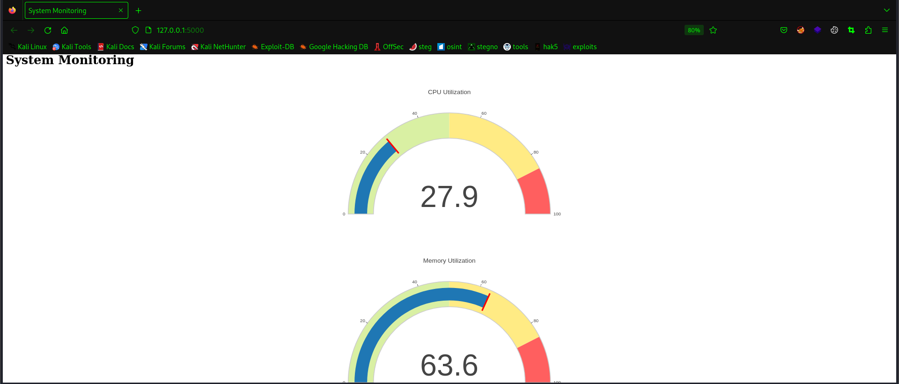

# Cloud Native Monitoring Application on Kubernetes

This is a Python-based monitoring tool that shows CPU and memory usage. It's dockerized for easy deployment and scalability, and runs on a Kubernetes cluster in AWS using services like EKS.

# Prerequisites

- Docker
- AWS CLI
- kubectl
- An AWS account

# Getting Started

Build the Docker image:
```
docker build -t my_monitoring_app_image .
```

Push the Docker image to Docker Hub (replace 'username' with your Docker Hub username):
```
docker push username/my_monitoring_app_image:latest
```

Deploy the application on Kubernetes:
```
kubectl apply -f deployment.yaml
```

# Output


# Architecture

The application runs on a Kubernetes cluster for high availability and scalability. It's deployed as a set of pods managed by a deployment controller. It uses AWS EKS for managing the Kubernetes cluster, and AWS CloudWatch for logging and monitoring.

# Docker Image
```
https://hub.docker.com/u/yogesh0123
```
